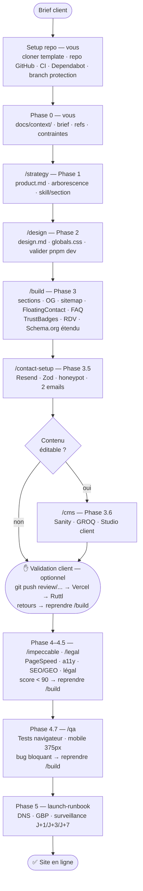

# Mobem — Workflow de création client

> Guide opérationnel complet. Une section = une étape = un livrable avant de passer à la suite.

---

## Vue d'ensemble



**Règle absolue : ne jamais passer à l'étape suivante sans valider la précédente.**
Chaque phase est une session Claude Code distincte. Ne pas tout faire dans la même session.

> **CI automatique** — GitHub Actions vérifie chaque push sur 3 jobs :
> - **Build · Lint · Audit** — `pnpm build` (TypeScript strict) · `pnpm lint` · `pnpm audit --audit-level moderate`
> - **Smoke tests** — 4 tests Playwright (homepage · sitemap · robots · contact API) lancés après le build
> - **Lighthouse CI** — scores ≥ 90 en accessibilité et SEO (bloquants) · performance ≥ 90 (avertissement)
>
> Si un badge CI est rouge avant de livrer, corriger avant de continuer.
> **Husky** bloque les commits locaux si ESLint détecte des erreurs — le problème est signalé avant même d'atteindre le CI.

---

## Setup repo — Avant tout (vous, 10 min)

### 1. Créer le repo depuis la template

```bash
# Cloner et réinitialiser l'historique
git clone <url-template> mon-projet-client
cd mon-projet-client
Remove-Item -Recurse -Force .git          # PowerShell
git init && git add . && git commit -m "init: boilerplate Mobem Solutions"

# Installer les dépendances
pnpm install && pnpm audit

# Configurer l'environnement
cp .env.example .env.local
# Remplir .env.local (ne jamais commiter)
```

### 2. Configurer le repo GitHub

Créer le repo sur github.com, puis :

```bash
git remote add origin https://github.com/[org]/[projet].git
git push -u origin main
```

### 3. Checklist GitHub (5 min dans Settings)

- [ ] **Vercel** — importer le repo dans le dashboard Vercel → déploiement automatique activé
- [ ] **Dependabot alerts** — Settings → Security → Enable Dependabot alerts
- [ ] **Branch protection** — Settings → Rules → Rulesets → créer une règle sur `main` :
  - Restrict deletions · Block force pushes
  - Require status checks : `Build · Lint · Audit`
- [ ] **Branche development** — `git checkout -b development && git push origin development`
- [ ] **Status checks** — Settings → Rules → ajouter `Smoke tests` et `Lighthouse CI` aux checks requis sur `main`

> Le CI (`.github/workflows/ci.yml`), Dependabot et Husky (pre-commit lint) sont hérités automatiquement.
> Husky s'active au premier `pnpm install` via le script `prepare` — aucune action requise.

---

## Phase 0 — Brief (vous, avant Claude)

Avant d'ouvrir Claude Code, constituez `docs/context/` avec ces fichiers :

```
docs/context/
├── brief.md (ou brief.pdf)     — objectifs, audience, ton, fonctionnalités
├── refs.md                     — 2-5 URLs de sites aimés + 1-2 sites à éviter
└── contraintes.md              — budget, délai, RGAA requis, contraintes techniques
```

**`refs.md` est la donnée la plus critique.** Sans références visuelles réelles,
Claude revient à ses defaults génériques. Si le client n'en a pas, posez-lui ces questions :

- "3 sites que vous aimez, même hors de votre secteur ?"
- "1 site que vous ne voulez absolument pas ressembler ?"
- "Un mot pour décrire l'ambiance souhaitée : sobre, chaleureux, premium, dynamique ?"

Ne lancez pas `/design` sans ces réponses.

### Skills optionnels en Phase 0

Si le brief est incomplet ou si le client n'a pas encore d'identité de marque clairement définie :

| Skill | Quand l'utiliser | Activation |
|-------|-----------------|------------|
| `brand-discovery` | Brief vague, client sans positionnement clair — fait l'audit audience, concurrence, territoire de marque | "Lis `.agents/skills/brand-discovery/` et applique-le au brief" |
| `brand-voice` | Client sans ligne éditoriale — génère les attributs de voix, les règles de ton, le vocabulaire | "Lis `.agents/skills/brand-voice/` et définis la voix de marque" |

---

---

> **⚡ NOUVELLE SESSION CLAUDE CODE**
> Ouvrir une nouvelle session avant `/strategy`. Un contexte propre garantit que les skills sont lus en entier et que le brief n'est pas dilué par la session de setup.

---

## Phase 1 — Stratégie produit

**Outil :** Claude Code CLI
**Commande :** `/strategy`
**Durée estimée :** 15–20 min
**Livrable :** `docs/product.md` complété

### Ce que fait la commande
- Lit `docs/context/` en entier
- Prouve sa lecture (cite 3 informations clés du brief)
- Remplit `docs/product.md` : présentation, problème, objectifs, audience, périmètre, ton, métriques
- Note `⚠️ À confirmer` pour chaque information manquante
- Propose une arborescence de 3 à 7 pages adaptée au secteur

### Votre validation
Relisez `docs/product.md` et vérifiez :
- [ ] L'arborescence correspond à ce que le client attend
- [ ] Les objectifs business sont corrects
- [ ] L'audience est bien décrite
- [ ] Les ⚠️ sont résolus ou acceptés
- [ ] `docs/feedback.md` mis à jour si friction ou insight notable durant cette phase

**STOP. Ne lancez pas `/design` avant d'avoir validé ce fichier.**

---

## Phase 1.5 — Validation visuelle (optionnel)

> À utiliser si le client a besoin de voir un visuel avant de valider la direction artistique.

### Option A — Vercel Preview + Ruttl *(recommandé)*

Vercel crée automatiquement une URL de preview pour chaque branche Git. Pas d'export manuel — les Server Components, routes API et Server Actions fonctionnent normalement.

**Étapes :**
```bash
git checkout -b review/[section-ou-phase]
git push origin review/[section-ou-phase]
# → Vercel génère automatiquement : https://[projet]-git-review-[...].vercel.app
```

1. Copier l'URL de preview Vercel (visible dans le dashboard ou dans le commentaire GitHub/PR)
2. Ouvrir [ruttl.com](https://ruttl.com) → "New Project" → coller l'URL → partager le lien au client
3. Le client clique sur n'importe quel élément pour laisser un commentaire épinglé — sans compte requis
4. Intégrer les retours, pousser sur la même branche → la preview se met à jour automatiquement

**Prérequis :** projet connecté à Vercel (`vercel link` ou import depuis le dashboard Vercel).
**Plan gratuit Ruttl :** 1 projet actif à la fois. Archiver le projet précédent avant d'en créer un nouveau.

### Option B — Images de référence
**Skills :** `imagegen-frontend-web` · `image-to-code`

Génère une image de référence par section (hero, features, footer) avant de coder.
Utile pour aligner le client visuellement dès la Phase 2, avant d'écrire du code.

**Activation :** "Lis `.agents/skills/imagegen-frontend-web/` et génère une référence visuelle pour la section [X]"

### Option C — Maquette Figma (si client veut annoter)

Utiliser le **Figma MCP** (compte Figma lié dans Intégrations claude.ai) pour générer une maquette navigable dans Figma. Le client peut y faire des commentaires directement. Une fois validée, revenir dans Claude Code avec `/figma` pour implémenter les modifications.

```
# Vérifier le compte actif
mcp__claude_ai_Figma__whoami

# Générer la maquette depuis le design system du projet
/figma  →  "Génère une maquette Figma pour la section hero depuis docs/design.md"
```

> **Quand choisir Option C plutôt que Ruttl :**
> - Le client est à l'aise avec les outils visuels et veut annoter directement sur les éléments
> - Vous avez besoin d'exporter des assets (icônes, illustrations) depuis la maquette
> - Le client fournit des maquettes Figma existantes à implémenter (design-to-code)
>
> **Ruttl reste le défaut** pour la validation client simple (commentaires épinglés sur preview Vercel, sans compte requis).

---

> **⚡ NOUVELLE SESSION CLAUDE CODE**
> Ouvrir une nouvelle session avant `/design`. La session `/strategy` a saturé son contexte avec le brief — repartir propre évite les influences croisées sur les décisions de palette.

---

## Phase 2 — Direction artistique

**Outil :** Claude Code CLI
**Commande :** `/design`
**Durée estimée :** 20–30 min
**Livrable :** `docs/design.md` complété + tokens dans `globals.css`

### Ce que fait la commande
- Vérifie que `docs/product.md` est rempli — sinon refuse de continuer
- Vérifie que `docs/context/refs.md` existe — sinon demande les références et s'arrête
- Lit les skills Impeccable (typography, color, spatial) avant de proposer quoi que ce soit
- Propose 2 palettes OKLCH distinctes avec justification secteur
- Présente le résumé structuré (palettes + typographie + radius)
- Attend votre validation explicite avant d'écrire un seul fichier

### Skills d'esthétique — 1 skill par type de section

`/design` propose un mapping skill → type de section. Ne pas choisir un seul skill pour tout le projet si les sections ont des natures différentes.

| Skill | Esthétique | Idéal pour |
|-------|-----------|------------|
| `minimalist-ui` | Éditorial, monochrome chaud, typographique | Artisans premium, consultants, cabinets |
| `high-end-visual-design` | Agence, bento asymétrique, micro-haptics | Marques premium, hôtellerie, luxe accessible |
| `gpt-taste` | Awwwards, éditorial large, bento sans gap | Pages d'impact visuel (hero, about, CTA) |
| `industrial-brutalist-ui` | Brutalism industriel, grille suisse | Pages data-dense (tarifs, prestations, listes) · BTP |
| `stitch-design-taste` | Génère un DESIGN.md pour Google Stitch | Validation DA via Google Stitch |

**Règle :** un seul skill par section — jamais deux skills sur la même section. Mélanger gpt-taste (pages visuelles) + industrial-brutalist (pages data-dense) est autorisé et souvent souhaitable.

**Activation :** "Lis `.agents/skills/[nom-du-skill]/` avant de proposer la direction artistique"

### Votre validation
Répondez "go palette A" ou "go palette B" (ou demandez des ajustements).
Claude écrit ensuite :
- `docs/design.md`
- `src/app/globals.css` (tokens OKLCH + polices chargées)
- `src/app/layout.tsx` (polices Google Fonts)
- `src/lib/constants/colors.ts` (THEME_META)

- [ ] `docs/feedback.md` mis à jour si friction ou insight notable durant cette phase

**STOP. Ne lancez pas `/build` avant d'avoir vu le rendu dans le navigateur.**
Lancez `pnpm dev` et vérifiez visuellement que les couleurs et polices sont correctes.

---

> **⚡ NOUVELLE SESSION CLAUDE CODE**
> Ouvrir une nouvelle session avant chaque `/build [section]`. Pour les sites de plus de 4 sections, ouvrir une session par section — la qualité des outputs se dégrade nettement quand le contexte dépasse ~60k tokens.

---

## Phase 3 — Développement

**Outil :** Claude Code CLI
**Commande :** `/build [section]`
**Durée estimée :** selon complexité
**Livrable :** composants codés, un par commit

### Ordre de développement recommandé
```
1. header.tsx + footer.tsx (navigation réelle, NAP, CTA)
2. Hero section (section la plus critique visuellement)
3. Sections de contenu (dans l'ordre de l'arborescence)
4. Pages secondaires
5. Formulaire de contact
6. SEO + Schema JSON-LD
```

### Ce que fait la commande
Pour chaque composant :
- Vérifie la présence des tokens dans `docs/design.md`
- Cite la règle Impeccable la plus pertinente avant de coder
- Cite l'anti-pattern le plus probable à éviter
- Code le composant
- Vérifie la checklist SKILL.md mentalement

**Un composant = un commit.** Ne jamais accumuler plusieurs composants dans la même session
sans commit intermédiaire — vous perdez la traçabilité et le contrôle.

### Skill par section — appliquer le tableau de /strategy

`/strategy` produit un tableau "Skill par section" (hero · services · prestations · contact…). Avant de coder chaque section, vérifier quel skill y est associé et l'activer si ce n'est pas déjà fait dans la session.

```
Exemple de tableau produit par /strategy :
┌─────────────┬──────────────────────────┐
│ Section     │ Skill                    │
├─────────────┼──────────────────────────┤
│ Hero, About │ gpt-taste                │
│ Services    │ gpt-taste                │
│ Prestations │ industrial-brutalist-ui  │
│ Contact     │ gpt-taste                │
└─────────────┴──────────────────────────┘
```

Si le tableau est absent de `docs/product.md` : demander à Claude de le produire avant de commencer le `/build`.

### Skills utiles en Phase 3

| Skill | Quand l'utiliser | Activation |
|-------|-----------------|------------|
| `full-output-enforcement` | Toujours — prévient la troncature et les placeholders dans le code généré | Activer en début de session `/build` |
| `image-to-code` | Générer une image de référence avant de coder chaque section | "Lis `.agents/skills/image-to-code/` avant de coder cette section" |
| `redesign-existing-projects` | Client avec un site existant à refondre | "Lis `.agents/skills/redesign-existing-projects/`" |

### Après chaque page complète
```bash
pnpm run impeccable
```
Corrigez tous les problèmes détectés avant de passer à la page suivante.

Dans Claude Code :
```
/impeccable audit [nom de la page]
/impeccable critique [nom de la page]
```

---

---

> **⚡ NOUVELLE SESSION CLAUDE CODE**
> Ouvrir une nouvelle session avant `/contact-setup`. Le formulaire de contact touche à la sécurité (Zod, honeypot, rate limiting) — un contexte propre évite les oublis de validation.

---

## Phase 3.5 — Formulaire de contact production-ready

**Commande :** `/contact-setup`
**Durée estimée :** 20–30 min
**Livrable :** route `/api/contact` + honeypot + emails Resend + gestion d'états UI

À lancer après la section contact visuelle, avant `/impeccable`. Sans cette phase, les leads ne partent nulle part.

### Ce que fait la commande

1. Installe `resend` + `zod`
2. Crée la route `src/app/api/contact/route.ts` avec validation Zod stricte + `import 'server-only'`
3. Ajoute le champ honeypot dans le formulaire HTML (`aria-hidden`, invisible, détecte les bots)
4. Configure 2 emails via Resend : notification au professionnel + confirmation au visiteur
5. Gère les états UI : idle / sending / success / error avec fallback téléphone
6. (Optionnel) Rate limiting via `@upstash/ratelimit` si compte Upstash disponible

### Votre validation

- [ ] `RESEND_API_KEY` + `CONTACT_EMAIL_TO` dans `.env.local`
- [ ] `.env.example` mis à jour sans valeur
- [ ] Test soumission normale → 2 emails reçus (pro + visiteur)
- [ ] Test honeypot rempli → aucun email, réponse silencieuse `{ ok: true }`
- [ ] Bouton désactivé pendant l'envoi

---

## Phase 3.6 — CMS (si contenu éditable par le client)

**Commande :** `/cms`
**Durée estimée :** 30–45 min
**Livrable :** galerie réalisations connectée à Sanity · Studio invité au client

À lancer **uniquement** si le client veut mettre à jour son contenu sans faire appel au développeur (galerie de chantiers, blog de conseils, liste de services avec tarifs).

Ne pas lancer sur un site vitrine entièrement statique — le CMS ajoute une dépendance externe inutile si le contenu ne change jamais.

### Ce que fait la commande

1. Configure `@sanity/client` + `next-sanity` avec les variables d'environnement sécurisées
2. Crée les schémas Sanity adaptés au secteur (réalisations · services · témoignages · articles selon le besoin)
3. Remplace les données statiques dans les composants par des requêtes GROQ typées (Server Components)
4. Déploie le Studio Sanity hébergé → invite le client avec le rôle Editor

### Votre validation

- [ ] `SANITY_API_TOKEN` dans `.env.local` (jamais `NEXT_PUBLIC_`)
- [ ] Au moins 1 contenu créé dans le Studio → visible sur le site
- [ ] Client invité sur sanity.io avec le rôle Editor (pas Admin)
- [ ] `revalidate: 3600` configuré sur les requêtes GROQ

---

---

> **⚡ NOUVELLE SESSION CLAUDE CODE**
> Ouvrir une nouvelle session pour chaque skill d'audit (accessibility, performance, security, seo). Un skill d'audit lu dans un contexte frais inspecte le code sans biais de la session de développement.

---

## Phase 4 — Audit & livraison

**Commandes :** `/impeccable audit` · `/impeccable polish` · `/impeccable harden`

### Audits spécialisés — à lancer avant livraison

Activer chaque skill dans une session dédiée, dans cet ordre :

| Skill | Ce qu'il vérifie | Activation |
|-------|-----------------|------------|
| `accessibility-audit` | WCAG 2.1 AA complet — perceivable, operable, understandable, robust | "Lis `.agents/skills/accessibility-audit/` et audite [page]" |
| `performance-optimization` | Core Web Vitals (LCP, INP, CLS), bundle size, assets | "Lis `.agents/skills/performance-optimization/` et audite le site" |
| `security-baseline` | HTTPS, security headers, CSP, gestion des secrets | "Lis `.agents/skills/security-baseline/` et audite le repo" |
| `seo-aeo-geo` | SEO classique + optimisation pour AI search (Perplexity, ChatGPT, AI Overviews) | "Lis `.agents/skills/seo-aeo-geo/` et audite le contenu" |

### Checklist technique avant livraison

#### Build & TypeScript
- [ ] `pnpm build` sans warning TypeScript ni erreur
- [ ] `pnpm run impeccable` — zéro erreur
- [ ] Aucun `console.log` en production

#### Performance — mesurer sur URL de prod, pas en local
- [ ] PageSpeed Insights sur l'URL Vercel de prod (pas Lighthouse CLI) — [pagespeed.web.dev](https://pagespeed.web.dev)
- [ ] LCP < 2.5s (hero image : `priority` sur `next/image`, sinon c'est la cause n°1)
- [ ] INP < 200ms
- [ ] CLS < 0.1 (polices : vérifier `size-adjust` sur fallback ; images : vérifier dimensions explicites)
- [ ] Score global ≥ 90 Performance · Accessibilité · SEO · Best Practices

#### SEO & Schema
- [ ] Schema JSON-LD validé — [Google Rich Results Test](https://search.google.com/test/rich-results)
- [ ] `AggregateRating` présent dans le JSON-LD si des avis sont affichés (étoiles dans les SERPs)
- [ ] `FAQPage` schema présent si section FAQ — vérifier dans Rich Results Test
- [ ] Sitemap accessible : `/sitemap.xml` répond 200 avec du XML valide
- [ ] Robots accessible : `/robots.txt` répond 200
- [ ] OG image vérifiée — [opengraph.xyz](https://www.opengraph.xyz) ou partage WhatsApp de test
- [ ] NAP (nom · adresse · téléphone) cohérent sur toutes les pages

#### Analytics
- [ ] Plausible (ou Umami) installé et recevant des events — tester en production (pas en localhost)
- [ ] Aucun Google Analytics sans bandeau cookie CNIL (préférer Plausible)

#### Formulaire de contact
- [ ] Soumission réelle testée sur URL de prod → email reçu par le professionnel
- [ ] Email de confirmation reçu par le visiteur
- [ ] Test honeypot → aucun email envoyé

#### Accessibilité & UX
- [ ] Mobile 375px — pas d'overflow horizontal
- [ ] Dark mode testé — tous les tokens résolus
- [ ] Focus visible sur tous les éléments interactifs (tab navigation)
- [ ] Toutes les images ont `alt` + `width` + `height`
- [ ] Aucune couleur hardcodée — uniquement `var(--...)`

#### Contenu & Legal
- [ ] `docs/feedback.md` complété — bugs, frictions, améliorations
- [ ] Pages légales liées dans le footer (`/mentions-legales` · `/confidentialite` · `/cgv`)
- [ ] Aucun `TODO: [BLOQUANT]` restant dans les pages légales

### Checklist RGAA (niveau AA minimum)
- [ ] Contraste texte : 4.5:1 minimum (vérifier avec OKLCH Contrast Checker)
- [ ] Contraste UI (boutons, inputs) : 3:1 minimum
- [ ] Balises sémantiques — pas de div soup (`<main>`, `<nav>`, `<article>`, `<section>`)
- [ ] Ordre de lecture logique dans le DOM
- [ ] Aria uniquement si le HTML natif ne suffit pas
- [ ] Formulaires : labels visibles, messages d'erreur explicites
- [ ] Navigation au clavier complète

### Commande finale
```
/impeccable polish
```
Passe de cohérence globale avant de livrer — alignement typographique, espacement,
hiérarchie visuelle, micro-interactions.

---

## Phase 4.5 — Pages légales

**Commande :** `/legal`
**Durée estimée :** 15–20 min
**Livrable :** 3 pages légales adaptées au statut juridique + liens footer + checklist conformité

À lancer avant toute mise en ligne. Obligatoire dès qu'un formulaire de contact est présent.

### Ce que fait la commande

1. **Extrait** depuis `docs/product.md` : statut juridique, secteur, B2C/B2B, zone
2. **Applique le mapping** statut → contenu obligatoire :

   | Statut | TVA | Décennale | CGV |
   |--------|-----|-----------|-----|
   | Micro-entrepreneur | Franchise 293 B si < seuil | Oui si BTP | Oui (B2C) |
   | SARL / SAS | Assujetti → 10 % ou 20 % | Oui si BTP | Oui (B2C) |
   | Profession libérale | Variable | Non | Conditions d'honoraires |

3. **Génère** les 3 pages adaptées au statut (mentions légales · confidentialité · CGV ou honoraires)
4. **Checklist de conformité** adaptée au statut (micro-entrepreneur vs SARL vs profession libérale)
5. **Liste les TODO bloquants** — à résoudre avant mise en ligne (SIRET, médiateur, assureur décennale…)
6. **Met à jour le footer** avec les liens légaux

### Votre validation

- [ ] Tous les `TODO: [BLOQUANT]` résolus
- [ ] Date "Dernière mise à jour" renseignée dans les 3 pages
- [ ] Recommandation de relecture avocat transmise au client (obligatoire pour les CGV B2C)

---

---

> **⚡ NOUVELLE SESSION CLAUDE CODE**
> Ouvrir une nouvelle session pour `/qa`. Le QA teste le site comme un utilisateur — un contexte de développement en mémoire peut biaiser vers "ça devrait marcher" plutôt que tester objectivement.

---

## Phase 4.7 — Tests navigateur

**Commande :** `/qa`
**Durée estimée :** 20–30 min
**Livrable :** checklist de test remplie + rapport QA

À lancer sur l'URL de preview Vercel (pas en `pnpm dev`) — les comportements prod et dev diffèrent, les emails Resend ne partent qu'en prod.

### Ce que fait la commande

1. Lit `docs/product.md` pour extraire les pages, CTAs exacts, numéro de téléphone et email
2. Génère une checklist de test **spécifique au site** — pas une liste générique
3. Guide le test du parcours visiteur complet :
   - Parcours critique : chaque page, chaque CTA avec son texte exact et sa destination
   - Formulaire de contact : soumission réelle → email reçu côté pro ET côté visiteur
   - Liens : `tel:`, `mailto:`, footer légal, aucun 404
   - Mobile 375px : overflow, menu burger, formulaire au doigt
   - Console navigateur : zéro erreur rouge
   - Dark mode (si implémenté) : tous les tokens résolus

### Format des bugs trouvés

```
❌ [Page / Section] — [description du problème]
   Reproduction : [étapes exactes]
   Priorité : BLOQUANT | Majeur | Mineur
```

Les bugs **Mineurs** sont documentés dans `docs/feedback.md` pour après livraison.
Les bugs **BLOQUANTS** doivent être corrigés, poussés sur la branche review, et retestés avant de continuer.

### Votre validation

- [ ] Zéro bug BLOQUANT ouvert
- [ ] Formulaire testé sur l'URL de prod — 2 emails reçus (pro + visiteur)
- [ ] Mobile 375px — pas d'overflow horizontal
- [ ] Console navigateur — zéro erreur rouge

**STOP. Ne pas passer à la mise en ligne tant qu'un bug BLOQUANT est ouvert.**

---

---

> **⚡ NOUVELLE SESSION CLAUDE CODE**
> Ouvrir une nouvelle session pour la mise en ligne. Le launch-runbook couvre DNS, GBP et monitoring — des actions irréversibles qui méritent un contexte clair et sans résidus.

---

## Phase 5 — Mise en ligne

**Skill :** `launch-runbook`
**Durée estimée :** 30–60 min

Planifie et exécute la mise en production : vérifications pré-lancement, bascule DNS, monitoring post-lancement, critères de rollback.

**Activation :** "Lis `.agents/skills/launch-runbook/` et génère le runbook de mise en ligne pour ce projet"

### Actions spécifiques sites artisans — à inclure dans le runbook

**Google Business Profile (obligatoire pour le local pack) :**
- Vérifier que le profil GBP existe et est revendiqué par le client
- Mettre à jour l'URL du site dans le GBP avec le nouveau domaine
- Vérifier la cohérence NAP (Nom · Adresse · Téléphone) entre GBP, site et schema JSON-LD
- Ajouter les photos récentes si absentes (photo de l'artisan au travail, véhicule, réalisations)

Un artisan sans GBP vérifié n'apparaît pas dans le local pack Google — même avec un site parfait.

### Fenêtre de surveillance — J+1 à J+7

Les 7 premiers jours après la mise en ligne sont critiques : les caches se remplissent, l'indexation commence, et les premiers vrais visiteurs testent le formulaire. Ne pas fermer ce projet avant J+7.

**J+1 — Console et erreurs**
- [ ] Ouvrir le site sur l'URL de production, vérifier la console (F12) : zéro erreur rouge
- [ ] Vérifier les logs Vercel (Dashboard → Deployments → Functions) : aucune erreur 500 sur `/api/contact`
- [ ] Si `SENTRY_DSN` configuré : ouvrir le dashboard Sentry et confirmer que le projet reçoit des événements (au moins le premier chargement de page)
- [ ] Tester le formulaire de contact une dernière fois depuis un appareil mobile réel (pas DevTools)

**J+3 — Indexation**
- [ ] Google Search Console : soumettre le sitemap (`/sitemap.xml`) si ce n'est pas encore fait
- [ ] Vérifier que la page d'accueil est en cours d'indexation (Inspection d'URL → "URL est sur Google")
- [ ] Vérifier la cohérence NAP entre le site, le schema JSON-LD, et la fiche GBP

**J+7 — Métriques et bilan**
- [ ] Plausible : au moins quelques pages vues remontent sur le dashboard (confirme que le script est actif en prod)
- [ ] PageSpeed Insights sur l'URL de prod — comparer avec les scores pré-lancement
- [ ] Confirmer que le client a bien reçu des leads via le formulaire (ou signaler si aucun visiteur)
- [ ] Documenter les bugs mineurs restants dans `docs/feedback.md` si ce n'est pas déjà fait
- [ ] Archiver le projet Ruttl si une session de commentaires client était active
- [ ] Compléter et envoyer `docs/handoff.md` au client (accès Plausible, Sanity Studio si CMS, GBP, contact urgence)

---

## Phase 5.5 — Release & document de livraison

À faire une fois le site en ligne, stable et validé J+1.

### 1. Remplir le document de livraison

```bash
# Ouvrir docs/livraison-config.json et remplir toutes les valeurs
# Puis générer le document HTML :
pnpm livraison
# → crée docs/livraison-[client].html
```

Ouvrir le fichier HTML dans le navigateur → **Imprimer → Enregistrer en PDF** → envoyer au client.

### 2. Créer la release GitHub

```bash
# Taguer la version finale
git tag v1.0.0
git push origin v1.0.0

# Créer la release depuis GitHub.com ou via CLI :
gh release create v1.0.0 --title "v1.0.0 — Mise en ligne" --notes "Site livré au client le [date]"
```

> La GitHub Action `.github/workflows/release.yml` s'exécute automatiquement :
> elle génère le document de livraison depuis `docs/livraison-config.json` et l'attache à la release.

### 3. Checklist de clôture

- [ ] `docs/livraison-config.json` rempli avec les vraies valeurs
- [ ] `docs/handoff.md` complété et envoyé au client (version interne + version client)
- [ ] `docs/feedback.md` complété — bugs restants, frictions, améliorations pour le prochain projet
- [ ] Projet Ruttl archivé (limite plan gratuit : 1 projet actif)
- [ ] Accès Vercel / domaine transmis au client avec le document de livraison

---

## Référence rapide — Commandes Claude Code

### Obligatoires (chaque projet)

| Commande | Phase | Ce qu'elle fait |
|----------|-------|-----------------|
| `/strategy` | 1 | Lit le brief, remplit docs/product.md |
| `/design` | 2 | Propose palettes, remplit docs/design.md + globals.css |
| `/build [section]` | 3 | Code un composant selon la DA validée — inclut OG image, sitemap, robots, FAQ schema |
| `/contact-setup` | 3.5 | Route API contact + Resend + honeypot + emails + états UI |
| `/impeccable audit [page]` | 3–4 | Audit technique post-génération — à lancer après chaque page |
| `/impeccable polish` | 4 | Passe finale avant livraison |
| `/qa` | 4.7 | Tests navigateur du parcours visiteur — génère la checklist depuis docs/product.md, à lancer sur l'URL Vercel |

### Optionnelles (selon le projet)

| Commande | Quand l'utiliser |
|----------|-----------------|
| `/cms` | 3.6 | Sanity CMS — si le client veut mettre à jour son contenu sans développeur (galerie réalisations, blog, services) |
| `/figma` | Implémentation depuis specs Figma si le client fournit des maquettes existantes. La validation client se fait via Vercel Preview + Ruttl (voir Phase 1.5 Option A). |
| `/impeccable shape [section]` | Sections complexes (landing multi-blocs, formulaire avancé) — planifie l'UX avant de coder. Inutile sur un site vitrine simple. |
| `/impeccable critique [page]` | Second regard design si `/impeccable audit` ne suffit pas. |
| `/impeccable harden` | Projets avec formulaires, i18n, ou edge cases à traiter. |
| `/impeccable teach` | Reprise d'un projet existant sans historique de session. Inutile si `/strategy` + `/design` ont déjà été faits dans ce projet. |
| `/legal` | Génère mentions légales, politique de confidentialité, CGV — avant mise en ligne. |

---

## Référence — Skills passifs (activation manuelle)

Ces skills n'ont pas de slash command. On les active en demandant à Claude de les lire avant de commencer une tâche.

| Skill | Phase | Rôle |
|-------|-------|------|
| `brand-discovery` | 0 | Recherche amont — audience, concurrence, positionnement |
| `brand-voice` | 0–1 | Voix de marque — attributs, ton, vocabulaire |
| `minimalist-ui` | 2 | Direction artistique éditorial/monochrome |
| `high-end-visual-design` | 2 | Direction artistique premium/agence |
| `gpt-taste` | 2 | Direction artistique Awwwards/éditorial large |
| `industrial-brutalist-ui` | 2 | Direction artistique industriel/brutalist |
| `stitch-design-taste` | 2 | DESIGN.md pour validation via Google Stitch |
| `imagegen-frontend-web` | 1.5–3 | Images de référence par section avant code |
| `image-to-code` | 3 | Génère image de référence puis implémente |
| `full-output-enforcement` | 3 | Prévient troncature et placeholders dans le code |
| `redesign-existing-projects` | 3 | Audit et upgrade d'un site existant |
| `accessibility-audit` | 4 | Audit WCAG 2.1 AA complet |
| `performance-optimization` | 4 | Core Web Vitals, bundle, assets |
| `security-baseline` | 4 | HTTPS, headers, CSP, secrets |
| `seo-aeo-geo` | 4 | SEO + AEO/GEO pour AI search |
| `launch-runbook` | 5 | Procédures de mise en production |
| `brandkit` | tout | Génération d'identité visuelle (logo, brand board) |
| `imagegen-frontend-mobile` | 2–3 | Écrans app mobile iOS/Android (si PWA ou app) |
| `legal-pages` | 4.5 | Pages légales françaises — mentions légales, confidentialité, CGV |
| `skill-creation-walkthrough` | meta | Créer un nouveau skill Claude |

---

## Erreurs fréquentes à éviter

**Déplacer le dossier projet après `pnpm install`**
→ pnpm stocke les modules avec des chemins absolus dans le virtual store. Si le dossier est déplacé ou renommé, les imports cassent silencieusement.
→ Fix : `Remove-Item node_modules -Recurse -Force && pnpm install` (PowerShell) ou `rm -rf node_modules && pnpm install` (bash) depuis le nouveau chemin.

**`pnpm install` se termine avec `ERR_PNPM_UNEXPECTED_VIRTUAL_STORE`**
→ Le virtual store est corrompu ou pointe vers un ancien chemin.
→ Fix : `rm -rf node_modules && pnpm install`

**CI bloqué sur `ERR_PNPM_OUTDATED_LOCKFILE`**
→ `pnpm-lock.yaml` n'a pas été commité après un `pnpm add` ou `pnpm remove`.
→ Fix : toujours commiter `pnpm-lock.yaml` immédiatement après toute modification de dépendances. Règle : `pnpm add X` ou `pnpm remove X` → `git add pnpm-lock.yaml` dans le même commit.

**Tout faire dans une seule session CLI**
→ Le contexte des skills se dilue. Résultat : composants génériques.
→ Fix : 3 sessions distinctes, une par phase.

**Lancer `/design` sans références visuelles**
→ Claude génère une palette "plausible" mais déconnectée du client.
→ Fix : `docs/context/refs.md` obligatoire avant `/design`.

**Valider la palette sans lancer `pnpm dev`**
→ Les valeurs OKLCH sur papier ne donnent pas la même impression que dans le navigateur.
→ Fix : toujours vérifier visuellement avant de passer au code.

**Mesurer Lighthouse en local plutôt que sur l'URL de prod**
→ Lighthouse CLI / DevTools en localhost donne des scores 10-20 points supérieurs à la réalité (pas de réseau, pas de CDN cold start, pas de vraie connexion mobile).
→ Fix : toujours mesurer via PageSpeed Insights sur l'URL Vercel de production.

**Hero image sans `priority` sur `<Image />`**
→ Le LCP (Largest Contentful Paint) sera > 2.5s. C'est systématiquement la cause n°1 d'un mauvais score Performance.
→ Fix : `<Image priority />` obligatoire sur toute image above-the-fold (hero, logo si grand).

**Accumuler des composants sans audit intermédiaire**
→ Les anti-patterns s'accumulent et deviennent coûteux à corriger.
→ Fix : `pnpm run impeccable` après chaque page.

**Activer plusieurs skills d'esthétique en même temps sur la même section**
→ Les directives se contredisent et Claude produit un résultat hybride sans cohérence.
→ Fix : un seul skill par type de contenu (ex : gpt-taste sur les pages visuelles, industrial-brutalist sur les pages data-dense). Ne jamais en mélanger deux sur la même section.
